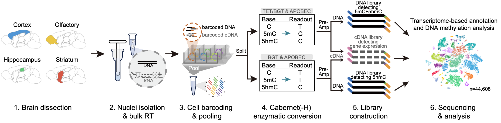
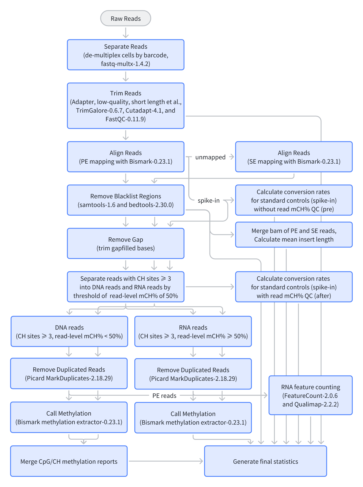
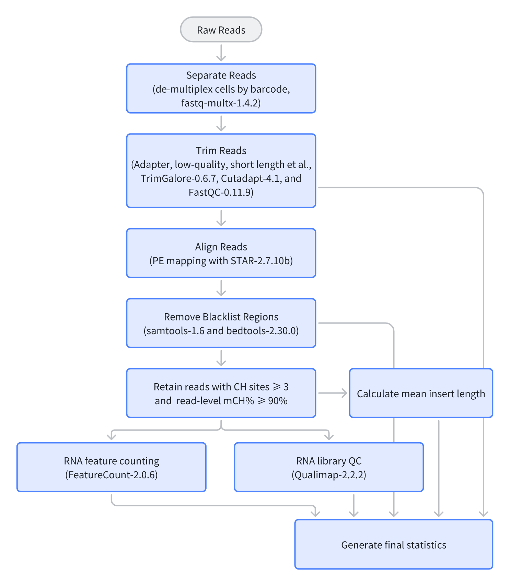

# MouseBrain_epiAtlas

**Scalable single-cell joint profiling of DNA 5mC, 5hmC and transcriptomes in the brain**

This repository hosts the analysis code for building a single-cell 5hmC atlas of the mouse brain, based on the **Joint-Cabernet** (also known as TSO-joint during our development) method that co-captures RNA, 5mC, and 5hmC from the same cell. The key idea is that the DNA and RNA fragments from the same single cells are barcoded before pooling for enzymatic conversion based on the **Cabernet** technique, with 3 libraries generated for the co-detection. 5hm-dCTP was used in place of standard dCTP during reverse transcription to preserve the original sequence of RNA fragments from enzymatic conversion, with a computational filtration step implemented in the pipeline (genomic DNA is low-mCH, while reverse-transcribed RNA is high-mCH), similar to that in snmCAT-seq.



## Repository layout

```
MouseBrain_epiAtlas/
├── 00.TSO-joint.pipeline/      # Preprocessing: FASTQ → per-cell ALLC / counts
│   ├── data/                   # Barcode files & schematic
│   ├── scripts/                # Core DNA & RNA pipeline scripts
│   └── test/                   # Small test FASTQs (mC / hmC / RNA)
├── 01.Young_Mouse/             # Young-mouse downstream analysis
│   ├── 01.RNA-integration/     #   Integrate Joint-Cabernet RNA with Zeng 10X
│   ├── 02.benchmark/           #   QC / benchmarking across modalities
│   ├── 03.Joint-Cabernet.cellType_State/  #   Methylation states per cell type
│   ├── 04.subclass.DMR/        #   Subclass DMR/DHMR calling
│   ├── 05.epigenetic.DHMR_3C/  #   DHMRs vs 3D chromatin (A/B compartments & loops)
│   └── 06.epigenetic.DHMR_Histone/  #   DHMRs vs histone marks
├── 02.Young_Mouse.Brain_slice/ # Spatial integration with Zhuang MERFISH
├── 03.data/                    # References, metadata, download info, configs
└── README.md
```

Folders are sequential — each stage's outputs feed the next. Code is mostly Jupyter notebooks, R, and Python, with shell drivers for the cluster pipeline.

## Prerequisites

Preprocessing runs on a SLURM cluster. Tool versions used: `fastq-multx` 1.4.2, `seqkit` 2.3.0, `trim_galore` 0.6.7 / `cutadapt` 4.1 / `FastQC` 0.11.9, `Bismark` 0.23.1 (bowtie2), `STAR` 2.7.10b, `samtools` 1.6, `bedtools` 2.30.0, `Picard` 2.18.29, `featureCounts` 2.0.6, `qualimap` 2.2.2, `methylpy` 1.4.6, `allcools` 1.0.8. Python helpers use pysam.

Downstream analysis using R: `Seurat` (SCT + RPCA), `glmGamPoi`, `presto`, `Monocle`, `MuDataSeurat`, `pheatmap`. Python: `scanpy`, `anndata`, `pyBigWig`, `cooltools`, `allcools`. Tools: `wgbstools`, `chromosight`, `cooler`.

Reference: `mm10` (mouse). Spike-ins for conversion QC, for example, lambda (unmethylated), pUC19 (fully CpG-methylated), and clai (fully hydroxymethylated), which we used.

## 1. Preprocessing (`00.TSO-joint.pipeline`)

Two phases: demultiplex the pooled plate into per-cell FASTQs, then process each cell through the DNA or RNA pipeline. See `00.TSO-joint.pipeline/README.md`.

### Phase 1 — Demultiplexing

`run.tso.96barcode.sh` (8-nt barcodes) or `run.tso.384barcode.sh` (10-nt barcodes) split a pooled plate by cell barcode with `fastq-multx -m 2 -d 0`, then `seqkit subseq -r 20:-1` trims the 19-bp Tn5 ME + barcode prefix from R1. Output: `Output_s1/sep_cell/{cell_id}.R1/R2.fastq.gz`. Barcode files: `data/V2_TSO_Barcode_for_fastq_multx.txt` (96) and `data/V3_TSO_Barcode_384.for_fastq_multx.txt` (384).

### Phase 2 — Per-cell processing

`run.forDNA.PE_SE.sh` and `run.forRNA.PE.sh` iterate per-cell FASTQs and submit SLURM jobs (`--species mm10 --seq_type nextera --thread 10`). Note that the DNA pipeline and the RNA pipeline should be run separately, with a good practice being setting up 'DNA' and 'RNA' folders for clear separation.

**DNA pipeline (`pip.forDNA.sh`)** — Bismark-based; mCH-based DNA filtering, methylation calling.



1. `trim_array` — `trim_galore --paired --phred33 --length 20 --retain_unpaired` + FastQC.
2. `mapping` — Bismark PE alignment (`--non_directional --unmapped --bowtie2`); MAPQ≥1 + blacklist filter; unmapped R1/R2 re-aligned as SE to recover reads; PE+SE merged. Picard `CollectInsertSizeMetrics`.
3. `remove_Gap_sepReads` (PE & SE) — `RemoveGap_seperateRNAreadsbymCs.v2.py`: removes the 9-bp Tn5 gap, then splits reads with ≥3 CH sites into **DNA** (mCH<50%) vs **RNA** (mCH≥50%).
4. `Remove_Duplicates` — Picard `MarkDuplicates` on PE/SE × DNA/RNA.
5. `call_methyl` — `bismark_methylation_extractor -p/-s --cytosine_report --CX_context`; PE+SE CpG reports merged via `merge_PE_SE_report.py`.
6. `FeatureCount_Qualimap` — `featureCounts` + `qualimap` on DNA and RNA BAMs.
7. `spike_in` (PE only) — re-align unmapped reads to lambda / pUC19 / clai; report conversion rates **pre** and **after** DNA/RNA separation to quantify RNA-read contamination.
8. `Final_stat` → `{sampleid}.total.stat.txt`.
9. `merge_CH_report` — `methylpy merge-allc` → `allcools standardize-allc` (final standardized ALLC).


**RNA pipeline (`pip.forRNA.sh`)** — STAR-based; mCH-based RNA filtering, counting.



1. `trim_array` — `trim_galore --paired --phred33 --length 20 --retain_unpaired`.
2. `mapping` — `STAR` PE (`--alignEndsType Local --outFilterMultimapNmax 1 --outFilterMismatchNoverLmax 0.04 --alignIntronMax 1000000 --sjdbOverhang 100`); MAPQ≥1 + blacklist filter.
3. `select_rna` — `mct_star_bam_filter.split_bys.py` keeps reads with ≥3 CH sites and mCH≥90%.
4. `feature_count.stranded` — `featureCounts -s 1`.
5. `Qualimap_for_QC_stranded` — `qualimap rnaseq -p strand-specific-forward`.
6. `Final_stat` → `{sampleid}.total.stat.txt`.

Key DNA/RNA differences: aligner (Bismark vs STAR), read separation (mCH<0.5 vs ≥0.9), gap removal & dedup & spike-ins & ALLC output (DNA only), RNA count output (RNA only).

### Inputs

- **Raw data:** pooled plate paired-end FASTQs in `raw_data/`. Filenames encode plate ID + modality (e.g. `P56_Male_..._TSO_5hmC_plate9_R1.fastq.gz`). R1 must begin with the barcode + 19-bp Tn5 ME prefix. Test data in `00.TSO-joint.pipeline/test/`.
- **Barcodes:** provided in `00.TSO-joint.pipeline/data/` — choose the one matching your plate scheme.
- **References (pre-build):** Bismark + STAR indexes for `mm10`/`hg38` and spike-ins; blacklists (`mm10.blacklist.bed`); GTF (gencode.vM18 for mm10); chrom sizes (`03.data/01.ref/mm10.chrom.sizes.nochrM.txt`).
- **Driver args:** `--indir`, `--outdir`, `--prefix`, `--species` (`mm10`/`hg38`), `--seq_type` (`nextera`), `--read_len` (20), `--partition`, `--thread`. DNA-only tuning: `--Gap_len 9`, `--m_threshold 0.5`, `--min_CH_num 3`, `--min_BaseQuality 25`, `--min_MappingQuality 30`.

### Outputs

Each cell writes to `$outdir/${sampleid}/`. For the DNA pipeline, filenames embed `{sampleid}.{species}.{PE|SE}.{dna|rna}...`; spike-in files use the spike-in name (`lambda`/`fullpuc19`/`clai`) in place of species.

```
${sampleid}/
├── align/            # BAMs: PE/SE/merged.PE_SE, dna/rna-separated, .rmdup, + spike-in subdirs
├── feature_count/    # featureCounts gene-length tables (dna, rna)
├── methyl/           # bismark_methylation_extractor: {CpG,CHG,CHH}_context, bedGraph.gz, bismark.cov.gz
├── Qualimap_for_QC/  # qualimap rnaseq output
├── stat/             # *.total.stat.txt (master QC row) + trim/align/methyl/spike-in stats
└── trim/             # trimmed FASTQs + FastQC reports
```
For the RNA pipeline, we mainly use the counts, `feature_count.stranded/{sampleid}.{species}.gene_counts.txt` in the RNA output folder.

Field lists for `*.total.stat.txt`:

<details>
<summary>DNA pipeline Final_stat fields</summary>

`SampleID`, `Total_reads`, `Clean_reads`, `Filter_reads_r`, `Filter_base_r`, `raw_depth`, `clean_depth`, `Aligned_Reads`, `Align_rate`, `COVERAGE`, `dna_reads_num`, `rna_reads_num`, `dna_reads_ratio`, `rna_reads_ratio`, `dna_reads_coverage`, `chrM_readsN`, `Dup_rate`, `Mean_Insertion_size`, `Depth_after_align`, `lambda_aligned`, `fullpuc19_aligned`, `clai_aligned`, `dna_CpG_Cov`, `dna_CGn`, `dna_mCG_R`, `dna_mCHG_R`, `dna_mCHH_R`, `rna_CpG_Cov`, `rna_CGn`, `rna_mCG_R`, `rna_mCHG_R`, `rna_mCHH_R`, `fullpuc19_CGn_pre/after`, `fullpuc19_mCG_R_pre/after`, `lambda_CGn_pre/after`, `lambda_mCG_R_pre/after`, `cla1_CGn_pre/after`, `cla1_mCG_R_pre/after`.

</details>

<details>
<summary>RNA pipeline Final_stat fields</summary>

`SampleID`, `Species`, `Total_reads`, `Clean_Reads`, `Reads_Clean_rate`, `Base_Clean_rate`, `reads_aligned`, `Align_rate`, `unique_reads_aligned`, `unique_Align_rate`, `RNA_reads`, `RNA_reads_ratio`, `COVERAGE`, `Mean_Insertion_size`, `FeatureCounts_Exon/Exonic/Intron/Intronic/IntergenicRegion/Intergenic`, `Exon_gene_number`, `Gene_gene_number`, `Qualimap_*`, `5_bias`, `3_bias`, `5_3_bias`.

</details>

## 2. Young-mouse analysis (`01.Young_Mouse`)

- **`01.RNA-integration`** — Integrate Joint-Cabernet RNA with the **Zeng 10X** reference (BICCN atlas) via Seurat SCT + RPCA; transfer `class`/`subclass`/`three_class` labels. This annotated RNA object scaffolds all downstream methylation analysis.
- **`02.benchmark`** — QC across the three modalities (RNA, 5hmC, 5mC+5hmC): methylation histograms, mCH-ratio curves, coverage/gene-count boxplots, read-count UMAP.
- **`03.Joint-Cabernet.cellType_State`** — Methylation biology per cell type: global CG/CH levels, pseudo-bulk ALLC merging (allcools), gene-group methylation curves, RNA–methylation correlation, ternary plots of (5hmCG, 5mCG, CG).
- **`04.subclass.DMR`** — D(H)MR calling for 5mCG and 5hmCG, neuron and non-neuron subclasses separately. wgbstools segments → segment MCDS → Wilcoxon rank-sum (1-vs-others, FDR) → call DMRs → volcano/heatmap/annotation. Overlap DMRs with genes.
- **`05.epigenetic.DHMR_3C`** — Hyper-DHMRs vs 3D chromatin (Liu 3C dataset): A/B compartments (mcool/cooltools), methylation–compartment correlation, chromosight loop calling, distal-regulatory analysis (Etl4, Vwc2).
- **`06.epigenetic.DHMR_Histone`** — Overlay H3K4me1/3, H3K9me3, H3K27ac, H3K27me3 on hyper-DHMRs; per-mark heatmaps.

Hyper-DHMRs from `04` feed both `05` and `06`.

## 3. Spatial slice analysis (`02.Young_Mouse.Brain_slice`)

Projects Joint-Cabernet cell types onto a spatial brain slice via integration with the **Zhuang MERFISH** atlas. Nine numbered R scripts (Seurat):

- `00` — subset Zhuang MERFISH to the matching z-slice (**7.33–7.34**) and regions (**Isocortex + Hippocampus**).
- `01` — per-class (Exc/Inh/Non) Seurat SCT + RPCA integration with Zhuang RNA; label transfer by per-cluster majority vote.
- `02` — assign each Joint-Cabernet cell the (x,y) of its nearest Zhuang cell in UMAP space (same subclass + region).
- `03` — combine all classes, re-integrate, carry over labels & loci → master spatial object.
- `04` — per-class UMAP QC plots.
- `05`/`06` — impute RNA zeros / methylation NAs by subclass mean.
- `07` — spatial maps of mapped cells on the whole-brain Zhuang background.
- `08` — Monocle DDRTree pseudotime along cortical IT layers (L2/3→L4/5→L5→L6); spatial overlay of RNA expression and DNA methylation for pseudotime markers.

## 4. Data & references (`03.data`)

- **`01.ref/`** — mm10 annotations: `mm10.chrom.sizes.nochrM.txt`, `mm10.genes.bed`, `PromoterUp2k.mm10.bed`, `gene_CpG_number_metainfo.csv`.
- **`02.metainfo/`** — **47,712 Joint-Cabernet cells**, each with matched RNA/5hmC/5mC. Master table `RNA_DNA_match_name_QC_class_label_young.csv` links the three per-modality IDs per `unique_id` with QC flags, `total_QC`, and class/subclass/region labels. Plus per-modality QC tables, global methylation tables, the 3C taxonomy cross-annotation (30 subclasses), and the brain-slice subset.
- **`03.download_data/`** — documents the Zhuang MERFISH download from **CELLxGENE** (dataset `f9f6cc29-7d06-47be-a798-e4e3b36a86b2`); the `z` column selects cells matching the Joint-Cabernet slice. Zeng 10X v3 is the integration reference.
- **`04.config_files/`** — R `.rds` class/subclass order & color palettes for consistent figures.

## Citation & contact

If you find this work useful, please cite the accompanying study. For questions or feedback, please feel free to open an issue.
